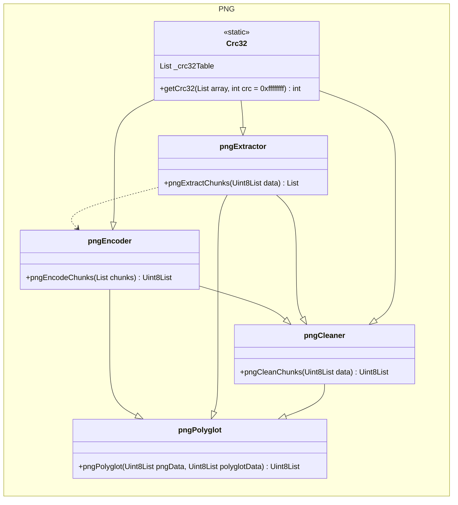

- pngPolyglot
    - png内のIDATチャンクを利用したポリグロットファイルの作成

```mermaid
classDiagram

%%png
pngEncoder --|> pngCleaner
pngExtractor --|> pngCleaner
pngEncoder --|> pngPolyglot
pngExtractor --|> pngPolyglot
pngCleaner --|> pngPolyglot
pngExtractor ..> pngEncoder
Crc32 --|> pngEncoder
Crc32 --|> pngExtractor
Crc32 --|> pngCleaner

	direction RL
	namespace PNG {
		class pngPolyglot {
			+pngPolyglot(Uint8List pngData, Uint8List polyglotData) Uint8List
		}
	
		class pngEncoder {
			+pngEncodeChunks(List chunks) Uint8List
		}
		class pngExtractor {
			+pngExtractChunks(Uint8List data) List
		}
		class pngCleaner {
			+pngCleanChunks(Uint8List data) Uint8List
		}
		class Crc32 {
			<<static>>
			List _crc32Table
			+getCrc32(List array, int crc = 0xffffffff) int
		}
	}
```
