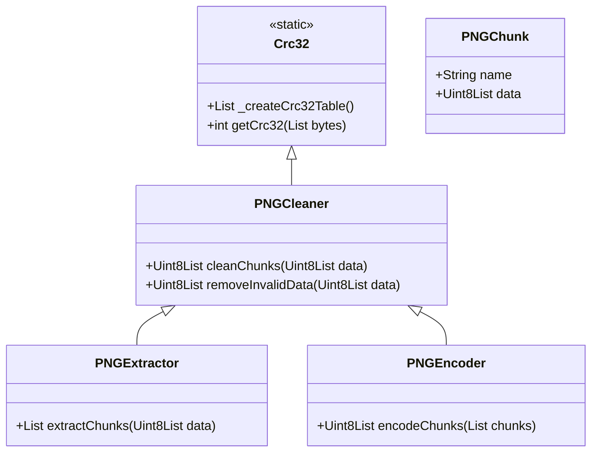

```mermaid
classDiagram
    class Crc32 {
        <<static>>
        +List<int> _createCrc32Table()
        +int getCrc32(List<int> bytes)
    }
    
    class PNGChunk {
        +String name
        +Uint8List data
    }
    
    class PNGEncoder {
        +Uint8List encodeChunks(List<PNGChunk> chunks)
    }
    
    class PNGExtractor {
        +List<PNGChunk> extractChunks(Uint8List data)
    }
    
    class PNGCleaner {
        +Uint8List cleanChunks(Uint8List data)
        +Uint8List removeInvalidData(Uint8List data)
    }
    
    Crc32 <|-- PNGCleaner
    PNGCleaner <|-- PNGExtractor
    PNGCleaner <|-- PNGEncoder
```
